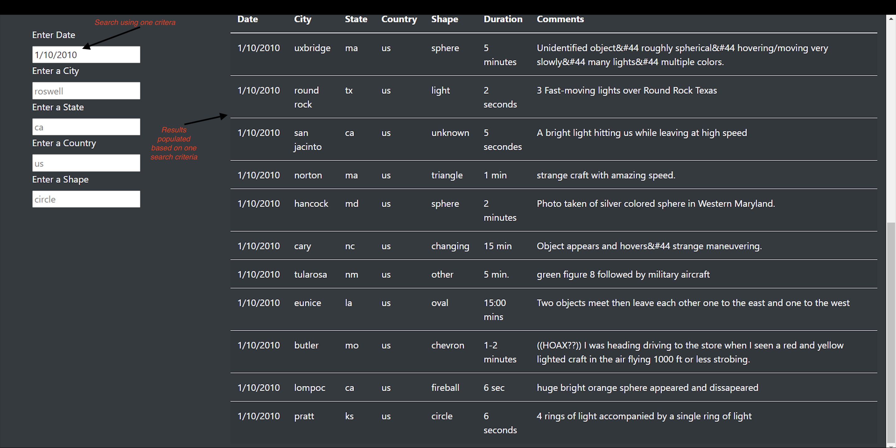

# UFOs

## Overview of the Project 
The purpose of the project was to help a journalist Dana to create a HTML page to display an article regarding UFO sightings and a dynamic table with all UFO sighting information that reacts based on the search criteria's entered by the user. For this project there was data stored regarding UFO sightings in a JavaScript array. In an HTML page this table of UFO sightings was rendered as a fully dynamic table. Allowing the user to the filter the data in the table with search criteria's such as: 
- Date 
- City 
- State 
- Country 
- Shape

The table reacts to user input based on the filtered criteria and also displays Dana's article providing an excellent visualization for any user interested in UFO sightings. 

## Results
This are the various ways search can be performed in the webpage created. 

### Searching with one criteria/ one filter  

From this image we can see that we can search by one criteria by entering our desired value in the desired criteria/filter field for example the "Enter Date" filter here. After inputting the filter value the user can press enter or click anywhere outside the filter form to see the filtered results in the table according to the criteria the user entered. 

### Searching with more than one criteria/ multipe filters

 
 
From this image we can see that we can search by more than one criteria by entering our desired value in the desired criteria/filter field for example the "Enter Date," "Enter a City" and "Enter a State" filter here. After inputting the filter value the user can press enter or click anywhere outside the filter form to see the filtered results in the table according to the criteria the user entered.

## Summary

The webpage is indeed very easy to read and allows the user to filter data according to certain criterias to help them retrieve the information. One of the drawback of this website is that there is no reset filter button that is visible to the user. The reset table and filter functionality of the page is embedded with the title of the page on the top left "UFO Sightings," however, it would be helful in terms of user experience if a button was also present. 

Also for further development in the future, the website can specify to the user the year the data is only available for, which is this case is the year 2010, so that the user knows better what date range the data is available for. Furthermore, there is a lot of white space between the subheading and the filter search form, therefore adding a bit more content there could make the page a bit more visually appealing. In all, it is a great interactive webpage that provides valuable information to UFO enthusiasts. 
